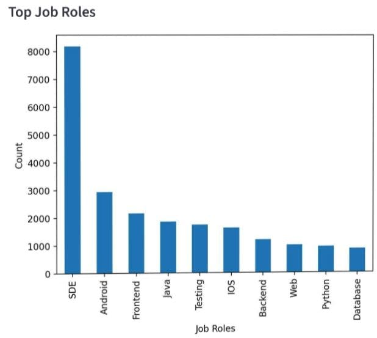

# 📊 Job Analysis Dashboard

## 📌 Project Overview
This project focuses on analyzing job roles and salary data using data visualization techniques. The goal is to understand industry trends, identify high-demand job roles, and explore salary patterns across different roles.

## 🎯 Objectives
- Analyze top in-demand job roles  
- Understand job role distribution  
- Study salary distribution  
- Explore salary vs rating relationship  
- Identify rating trends  

## 📊 Visualizations

## 🔹 Top Job Roles

  

## 🔹 Job Role Distribution

  

## 🔹 Salary vs Rating

  

## 🔹 Rating Distribution

  

## 🔹 Average Salary by Role

  

## 🔹 Salary Distribution

  

## 🛠️ Technologies Used
- Python  
- Pandas  
- Matplotlib  
- Seaborn  
- Jupyter Notebook  

## 📈 Insights
- SDE roles have high demand  
- Backend and Android roles are popular  
- Higher ratings tend to have better salaries  
- Most salaries fall in mid-range  

## 🚀 Conclusion
This project helps understand job market trends and salary insights using simple visualizations. It is useful for students and job seekers to make better career decisions.
